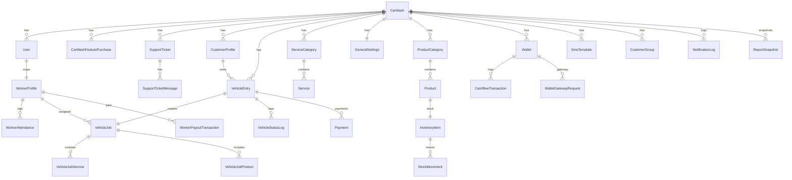

# CarWash Management Platform

پلتفرم مدیریت کارواش با معماری `Vue 3 + Django REST + MySQL + Docker Compose` که برای سناریوهای اپراتوری، مدیریت شعبه، پنل HQ، کیف پول، انبار، گزارش‌گیری، باشگاه مشتریان، حضور و غیاب پرسنل و تشخیص پلاک طراحی شده است.

## معرفی کلی پروژه

### معماری

- `frontend/`: رابط کاربری SPA بر پایه `Vue 3`, `Vite`, `Pinia`, `Vue Router`
- `backend/`: API و منطق کسب‌وکار بر پایه `Django 5`, `Django REST Framework`, `Gunicorn`
- `db`: پایگاه‌داده `MySQL 8.4`
- `plate-ai`: سرویس داخلی تشخیص پلاک با HTTP
- `edge-nginx`: لایه ورودی production برای دامنه، SSL و reverse proxy
- `certbot`: دریافت و تمدید SSL از Let's Encrypt

### نحوه ارتباط سرویس‌ها

- کاربر از مرورگر به `edge-nginx` یا مستقیم به `frontend` وصل می‌شود.
- `frontend` درخواست‌های `/api/*` را به `backend` proxy می‌کند.
- `backend` به `db` روی پورت داخلی `3306` وصل می‌شود.
- `backend` برای تشخیص پلاک به `plate-ai` روی `http://plate-ai:8765` درخواست می‌فرستد.
- فایل‌های `static` و `media` بین `backend` و `frontend` از طریق Docker volumes مشترک هستند.

### تکنولوژی‌ها

- Frontend: `Vue 3`, `Vite`, `Pinia`, `Vue Router`, `Axios`
- Backend: `Django`, `Django REST Framework`, `django-cors-headers`, `python-decouple`, `gunicorn`
- Database: `MySQL 8.4`
- Infra: `Docker`, `Docker Compose`, `Nginx`, `Certbot`

## لینک‌های دسترسی

### Production

- فرانت‌اند اصلی: `https://carnowash.ir`
- فرانت‌اند جایگزین: `https://www.carnowash.ir`
- API Health: `https://carnowash.ir/api/health/`
- API Base URL: `https://carnowash.ir/api/`
- پنل HQ: `https://carnowash.ir/hq`
- لاگین: `https://carnowash.ir/login`

### نکته درباره پنل ادمین Django

`django.contrib.admin` در تنظیمات فعال است، اما route مربوط به `/admin/` در [backend/config/urls.py](/mnt/newvolume/PRG/carvash/backend/config/urls.py:1) تعریف نشده است. در نتیجه در وضعیت فعلی پنل admin عمومی در دسترس نیست.

### آدرس‌های داخلی Docker

| سرویس | آدرس داخلی | پورت |
|---|---|---|
| `frontend` | `http://frontend` | `80` |
| `backend` | `http://backend` | `8000` |
| `plate-ai` | `http://plate-ai` | `8765` |
| `db` | `db` | `3306` |
| `edge-nginx` | `http://edge-nginx` | `80`, `443` |

### پورت‌های publish شده

- توسعه/compose پایه: `FRONTEND_PORT -> frontend:80`
- production: `80 -> edge-nginx:80`, `443 -> edge-nginx:443`
- production داخلی برای debug: `127.0.0.1:8080 -> frontend:80`

## ساختار پوشه‌ها

```text
carvash/
├── ai/
│   └── tst/Persian-License-Plate-Recognition/   # سرویس plate-ai
├── backend/
│   ├── apps/
│   │   ├── auth/            # احراز هویت، کارواش‌ها، HQ، تیکت پشتیبانی
│   │   ├── vehicles/        # ورود خودرو، job، پلاک، تسویه
│   │   ├── workers/         # پرسنل و حضور و غیاب
│   │   ├── services/        # خدمات و تنظیمات عمومی
│   │   ├── products/        # محصولات
│   │   ├── inventory/       # موجودی، خرید، هزینه
│   │   ├── payments/        # کیف پول، تراکنش‌ها، پرداخت
│   │   ├── notifications/   # SMS و باشگاه مشتریان
│   │   └── reports/         # گزارش‌ها و تسویه پرسنل
│   ├── config/              # settings, urls, wsgi, asgi
│   ├── docker/              # entrypoint بک‌اند
│   ├── Dockerfile
│   └── requirements.txt
├── docker/
│   ├── edge-nginx/          # Nginx لبه برای دامنه و SSL
│   └── mysql/init/          # init script دیتابیس
├── frontend/
│   ├── src/
│   │   ├── views/           # صفحات اپ
│   │   ├── components/      # کامپوننت‌های reusable
│   │   ├── router/          # routeهای SPA
│   │   ├── store/           # state management
│   │   └── services/        # axios client
│   ├── nginx/default.conf   # nginx داخلی frontend
│   ├── Dockerfile
│   └── package.json
├── scripts/                 # اسکریپت‌های deploy و renew
├── docker-compose.yml
├── docker-compose.production.yml
├── .env.example
├── .env.docker.example
├── .env.production.example
└── DEPLOY_LINUX.md
```

## Frontend Routes

Routeهای مهم SPA در [frontend/src/router/index.js](/mnt/newvolume/PRG/carvash/frontend/src/router/index.js:1):

| مسیر | توضیح | دسترسی |
|---|---|---|
| `/login` | صفحه لاگین | عمومی |
| `/attendance/:token` | ثبت حضور و غیاب عمومی کارگر | عمومی |
| `/hq` | پنل HQ | فقط HQ |
| `/` | داشبورد اصلی | `admin`, `owner`, `manager`, `operator`, `worker` |
| `/manager/wallet` | کیف پول و پرداخت‌ها | `accountant`, `admin`, `manager` |
| `/manager/customer-club` | باشگاه مشتریان و پیامک | `admin`, `manager` |
| `/manager/attendance` | مدیریت حضور و غیاب | `admin`, `manager` |
| `/manager/reports` | گزارش‌ها | `admin`, `manager` |
| `/manager/settings` | تنظیمات خدمات و عمومی | `admin`, `manager` |
| `/support` | تیکت پشتیبانی | اکثر نقش‌ها |

## احراز هویت و امنیت API

- مدل auth بر پایه `SessionAuthentication` و `BasicAuthentication` است.
- فرانت‌اند با `Axios` و `withCredentials=true` کار می‌کند.
- برای درخواست‌های mutating باید ابتدا `/api/auth/csrf/` فراخوانی شود.
- login از طریق session cookie انجام می‌شود، نه JWT.
- CSRF header با نام `X-CSRFToken` ارسال می‌شود.

### جریان لاگین

1. `GET /api/auth/csrf/`
2. `POST /api/auth/login/`
3. `GET /api/auth/me/`

## مستندات کامل API

Base URL:

```text
/api
```

### Health

| Method | URL | Auth | توضیح | Request | Response |
|---|---|---|---|---|---|
| `GET` | `/health/` | خیر | بررسی سلامت backend | ندارد | `{ "status": "ok" }` |

### Auth / Users / HQ

| Method | URL | Auth | توضیح | Request کلیدی | Response کلیدی |
|---|---|---|---|---|---|
| `GET` | `/auth/csrf/` | خیر | ست کردن CSRF cookie | ندارد | `detail` |
| `POST` | `/auth/login/` | خیر | لاگین با username یا phone | `username`, `password` | payload کاربر، نقش، tenant، menu access |
| `POST` | `/auth/logout/` | بله | خروج از حساب | ندارد | `detail` |
| `GET` | `/auth/me/` | بله | مشخصات کاربر جاری | ندارد | `id`, `username`, `role`, `platform_role`, `tenant_name`, `menu_access` |
| `GET` | `/auth/users/` | بله | لیست کاربران tenant | ندارد | آرایه کاربران tenant |
| `POST` | `/auth/users/` | بله | ایجاد کاربر tenant | `username`, `full_name`, `first_name`, `last_name`, `phone`, `role`, `password`, `is_active` | آبجکت کاربر |
| `POST` | `/auth/tenants/register/` | خیر | ثبت tenant جدید و manager اولیه | `carwash_name`, `carwash_slug`, `manager_full_name`, `manager_username`, `manager_phone`, `manager_password` | `tenant`, `manager` |
| `GET` | `/auth/support/tickets/` | بله | لیست تیکت‌های tenant | ندارد | آرایه تیکت |
| `POST` | `/auth/support/tickets/` | بله | ایجاد تیکت | `subject`, `message`, `category?`, `priority?` | تیکت کامل |
| `GET` | `/auth/support/tickets/:id/` | بله | جزئیات تیکت | path param | تیکت + `messages` |
| `POST` | `/auth/support/tickets/:id/messages/` | بله | پاسخ به تیکت | `body`, `status?`, `assign_to_user_id?`, `is_internal?` | تیکت به‌روزشده |
| `POST` | `/auth/support/tickets/:id/feedback/` | بله | امتیازدهی به پاسخ پشتیبانی | `customer_satisfaction`, `customer_feedback?` | تیکت به‌روزشده |
| `GET` | `/auth/hq/overview/` | HQ | داشبورد HQ | queryهای تحلیلی اختیاری | خلاصه کلان HQ |
| `GET` | `/auth/hq/carwashes/` | HQ | لیست کارواش‌ها | ندارد | آرایه کارواش با manager و menu access |
| `POST` | `/auth/hq/carwashes/` | HQ | ساخت کارواش و manager | `carwash_name`, `carwash_address?`, `manager_first_name`, `manager_last_name`, `manager_username`, `manager_phone`, `manager_password`, `purchased_menu_access[]?` | آبجکت کارواش |
| `PATCH` | `/auth/hq/carwashes/:id/` | HQ | ویرایش کارواش و feature access | `carwash_name?`, `carwash_address?`, `is_active?`, `manager_*?`, `purchased_menu_access[]?` | آبجکت کارواش |
| `GET` | `/auth/hq/carwashes/:id/insights/` | HQ | insightهای یک کارواش | path param | داده تحلیلی |
| `GET` | `/auth/hq/team/` | HQ | لیست تیم پشتیبانی HQ | ندارد | آرایه کاربران HQ |
| `POST` | `/auth/hq/team/` | HQ | ایجاد کاربر پشتیبانی HQ | `first_name?`, `last_name?`, `username?`, `phone?`, `password`, `tenant_id` | آبجکت کاربر |
| `PATCH` | `/auth/hq/team/:id/` | HQ | ویرایش پشتیبان HQ | `first_name?`, `last_name?`, `username?`, `phone?`, `password?`, `tenant_id?`, `is_active?` | آبجکت کاربر |
| `DELETE` | `/auth/hq/team/:id/` | HQ | حذف/غیرفعال‌سازی پشتیبان | path param | وضعیت عملیات |
| `GET` | `/auth/hq/tickets/` | HQ | لیست کل تیکت‌ها | queryهای فیلتر | آرایه تیکت |
| `GET` | `/auth/hq/tickets/:id/` | HQ | جزئیات تیکت HQ | path param | تیکت کامل |
| `POST` | `/auth/hq/tickets/:id/messages/` | HQ | پاسخ/assignment HQ | `body`, `status?`, `assign_to_user_id?`, `is_internal?` | تیکت به‌روزشده |
| `GET` | `/auth/hq/reports/` | HQ | گزارش‌های مدیریتی HQ | queryهای بازه زمانی | داده تحلیلی |

### Vehicles

Response اصلی از `VehicleEntrySerializer` می‌آید و شامل `job` و `status_logs` هم هست.

| Method | URL | Auth | توضیح | Request کلیدی | Response کلیدی |
|---|---|---|---|---|---|
| `GET` | `/vehicles/` | بله | لیست خودروهای tenant | query فیلتر/جست‌وجو | آرایه `VehicleEntry` |
| `POST` | `/vehicles/` | بله | ثبت ورود خودرو و ساخت job | `plate_number`, اجزای پلاک, `car_model`, `car_color`, `driver_name`, `driver_phone`, `status`, `notes?`, `worker_id?`, `worker_name?`, `services[]`, `products[]`, `staff_members[]`, `share{type,value}`, `tip_amount?`, `manual_discount_total?`, `blocked_plate_payment_confirmed?` | `VehicleEntry` کامل |
| `GET` | `/vehicles/:id/` | بله | جزئیات خودرو | path param | `VehicleEntry` |
| `PUT/PATCH` | `/vehicles/:id/` | بله | ویرایش اطلاعات خودرو/سرویس‌ها | مشابه serializer | `VehicleEntry` |
| `PATCH` | `/vehicles/:id/status/` | بله | تغییر status خودرو | `status`, `note?` | `VehicleEntry` |
| `GET` | `/vehicles/plate-status/` | بله | بررسی بلاک بودن پلاک | `plate_number` یا اجزای پلاک | وضعیت بلاک |
| `GET` | `/vehicles/plate-lookup/` | بله | lookup سوابق با پلاک | `plate_number` | سوابق مشتری/خودرو |
| `POST` | `/vehicles/plate-recognition/` | بله | ارسال تصویر/داده به plate-ai | payload وابسته به view | نتیجه تشخیص پلاک |
| `POST` | `/vehicles/:id/block-plate/` | بله | بلاک کردن پلاک خودرو | `note?` | وضعیت بلاک |
| `GET` | `/vehicles/:id/release/` | بله | پیش‌نمایش تسویه و release | path param | summary مالی |
| `PATCH` | `/vehicles/:id/release/` | بله | release نهایی و ثبت پرداخت | payload مالی/پرداخت | آبجکت release/update |

### Workers / Attendance

| Method | URL | Auth | توضیح | Request کلیدی | Response کلیدی |
|---|---|---|---|---|---|
| `GET` | `/workers/` | بله | لیست پرسنل tenant | ندارد | آرایه `WorkerProfile` |
| `POST` | `/workers/` | بله | ایجاد پرسنل | `full_name`, `username`, `password`, `phone`, `role`, `is_available`, `payment_type`, `payment_value`, `tip_share_percent`, `has_entrusted_item`, `entrusted_items[]` | `WorkerProfile` |
| `GET` | `/workers/:id/` | بله | جزئیات پرسنل | path param | `WorkerProfile` |
| `PUT/PATCH` | `/workers/:id/` | بله | ویرایش پرسنل | مشابه create | `WorkerProfile` |
| `DELETE` | `/workers/:id/` | بله | حذف پرسنل | path param | وضعیت عملیات |
| `GET` | `/workers/attendance/dashboard/` | بله | داشبورد حضور و غیاب | query بازه زمانی | `workers`, `recent_events`, summary |
| `POST` | `/workers/attendance/events/` | بله | ثبت ورود/خروج توسط مدیر | `worker_id`, `event_type`, `note?` | event ثبت‌شده |
| `POST` | `/workers/:id/attendance-token/refresh/` | بله | ساخت token جدید حضور و غیاب | path param | `attendance_token`, `attendance_path` |
| `GET` | `/workers/attendance/public/:token/` | خیر | نمایش وضعیت لینک حضور و غیاب | token | `worker`, وضعیت شیفت |
| `POST` | `/workers/attendance/public/:token/` | خیر | punch in/out عمومی | `event_type`, `note?` | event ثبت‌شده |

### Services / Settings

| Method | URL | Auth | توضیح | Request کلیدی | Response کلیدی |
|---|---|---|---|---|---|
| `GET` | `/services/` | بله | لیست خدمات tenant | ندارد | آرایه `Service` |
| `POST` | `/services/` | بله | ایجاد خدمت | `name`, `code?`, `description?`, `category`, `base_price`, `pricing_mode`, `estimated_duration_minutes`, `allow_price_override`, `is_active`, `display_order` | `Service` |
| `GET` | `/services/:id/` | بله | جزئیات خدمت | path param | `Service` |
| `PUT/PATCH` | `/services/:id/` | بله | ویرایش خدمت | مشابه create | `Service` |
| `DELETE` | `/services/:id/` | بله | حذف خدمت | path param | وضعیت عملیات |
| `GET` | `/services/:id/history/` | بله | تاریخچه تغییرات خدمت | path param | `ServiceChangeLog[]` |
| `GET` | `/services/general-settings/` | بله | دریافت تنظیمات عمومی | ندارد | `GeneralSettings` |
| `PUT/PATCH` | `/services/general-settings/` | بله | ویرایش تنظیمات عمومی | `discount_percent_per_half_star`, اطلاعات بانکی، POS، تنظیمات چاپ رسید | `GeneralSettings` |

### Products

| Method | URL | Auth | توضیح | Request کلیدی | Response کلیدی |
|---|---|---|---|---|---|
| `GET` | `/products/` | بله | لیست محصولات tenant | ندارد | آرایه `Product` |
| `POST` | `/products/` | بله | ایجاد محصول | `name`, `sku?`, `barcode?`, `unit`, `description?`, `sale_price`, `cost_price`, `min_stock`, `category?`, `is_active` | `Product` |
| `GET` | `/products/:id/` | بله | جزئیات محصول | path param | `Product` |
| `PUT/PATCH` | `/products/:id/` | بله | ویرایش محصول | مشابه create | `Product` |
| `DELETE` | `/products/:id/` | بله | حذف محصول | path param | وضعیت عملیات |

### Inventory / Expenses

| Method | URL | Auth | توضیح | Request کلیدی | Response کلیدی |
|---|---|---|---|---|---|
| `GET` | `/inventory/` | بله | لیست موجودی | ندارد | آرایه `InventoryItem` |
| `POST` | `/inventory/` | بله | ایجاد رکورد موجودی | `product`, `quantity_on_hand`, `reserved_quantity`, `min_quantity_alert`, `location` | `InventoryItem` |
| `GET` | `/inventory/:id/` | بله | جزئیات موجودی | path param | `InventoryItem` |
| `PUT/PATCH` | `/inventory/:id/` | بله | ویرایش موجودی | مشابه create | `InventoryItem` |
| `DELETE` | `/inventory/:id/` | بله | حذف موجودی | path param | وضعیت عملیات |
| `POST` | `/inventory/purchase/` | بله | ثبت خرید و افزایش موجودی | `product_id`, `quantity`, `unit_cost`, `sale_price?`, `note?`, `spent_amount?` | `InventoryItem`, `StockMovement`, `ExpenseEntry` |
| `GET` | `/inventory/product-history/:product_id/` | بله | تاریخچه خرید محصول | path param | لیست خرید/حرکت |
| `GET` | `/inventory/expenses/` | بله | لیست هزینه‌ها | ندارد | آرایه `ExpenseEntry` |
| `POST` | `/inventory/expenses/` | بله | ثبت هزینه دستی | `title`, `amount`, `details?` | `ExpenseEntry` |
| `GET` | `/inventory/expenses/:id/` | بله | جزئیات هزینه | path param | `ExpenseEntry` |
| `PUT/PATCH` | `/inventory/expenses/:id/` | بله | ویرایش هزینه | `title`, `amount`, `details` | `ExpenseEntry` |
| `DELETE` | `/inventory/expenses/:id/` | بله | حذف هزینه | path param | وضعیت عملیات |

### Payments / Wallet

| Method | URL | Auth | توضیح | Request کلیدی | Response کلیدی |
|---|---|---|---|---|---|
| `GET` | `/payments/wallet/dashboard/` | بله | داشبورد کیف پول‌ها و تراکنش‌ها | ندارد | `wallets`, `transactions`, totals |
| `GET` | `/payments/wallet/options/` | بله | گزینه‌های خرید feature | ندارد | لیست feature options و وضعیت خرید |
| `POST` | `/payments/wallet/options/` | بله | خرید feature برای tenant | `wallet_id`, `feature_key`, `payment_plan`, `upfront_amount?` | purchase summary |
| `POST` | `/payments/wallet/deposit/` | بله | واریز دستی به کیف پول | `wallet_id?`, `amount`, `description?` | `Wallet`, `CashflowTransaction` |
| `POST` | `/payments/wallet/deposit/start/` | بله | شروع شارژ gateway | `wallet_id?`, `amount`, `description?`, `return_url?` | `payment_url`, `token` |
| `GET` | `/payments/wallet/deposit/checkout/` | بله/Callback | تایید callback درگاه | query params | وضعیت پرداخت |
| `POST` | `/payments/wallet/withdraw/` | بله | برداشت از کیف پول | `wallet_id?`, `amount`, `description?` | `Wallet`, `CashflowTransaction` |

### Notifications / Customer Club

| Method | URL | Auth | توضیح | Request کلیدی | Response کلیدی |
|---|---|---|---|---|---|
| `GET` | `/notifications/customer-club/` | بله | داشبورد باشگاه مشتریان | ندارد | customers, templates, groups, logs, sms balance |
| `GET` | `/notifications/customer-groups/` | بله | لیست گروه‌های مشتری | ندارد | `CustomerGroup[]` |
| `POST` | `/notifications/customer-groups/` | بله | ایجاد گروه مشتری | `name`, `description?`, `mode`, `member_keys[]`, `rules{}` | `CustomerGroup` |
| `GET` | `/notifications/customer-groups/:id/` | بله | جزئیات گروه | path param | `CustomerGroup` |
| `PUT/PATCH` | `/notifications/customer-groups/:id/` | بله | ویرایش گروه | مشابه create | `CustomerGroup` |
| `DELETE` | `/notifications/customer-groups/:id/` | بله | حذف گروه | path param | وضعیت عملیات |
| `GET` | `/notifications/sms/templates/` | بله | لیست templateهای پیامک | ندارد | `SmsTemplate[]` |
| `POST` | `/notifications/sms/templates/` | بله | ایجاد template پیامک | `code`, `title`, `body`, `display_order`, `is_active` | `SmsTemplate` |
| `GET` | `/notifications/sms/templates/:id/` | بله | جزئیات template | path param | `SmsTemplate` |
| `PUT/PATCH` | `/notifications/sms/templates/:id/` | بله | ویرایش template | مشابه create | `SmsTemplate` |
| `DELETE` | `/notifications/sms/templates/:id/` | بله | حذف template | path param | وضعیت عملیات |
| `POST` | `/notifications/sms/send/` | بله | ارسال کمپین پیامکی | `template_code?`, `template_text`, `recipients[]`, `note?`, `target_label?` | نتیجه ارسال batch |
| `POST` | `/notifications/sms/simple/` | بله | ارسال پیامک ساده | `text`, `recipients[]`, `note?`, `target_label?` | نتیجه ارسال |

### Reports

| Method | URL | Auth | توضیح | Request کلیدی | Response کلیدی |
|---|---|---|---|---|---|
| `GET` | `/reports/dashboard/` | بله | داشبورد گزارش‌ها | query بازه زمانی | summary مالی و عملیاتی |
| `POST` | `/reports/workers/payouts/` | بله | ثبت پرداخت دستمزد/انعام/پاداش | payload وابسته به worker/job | تراکنش ثبت‌شده |
| `POST` | `/reports/workers/adjustments/` | بله | ثبت adjustment برای پرسنل | `worker_id`, `kind`, `amount`, `note` | transaction summary |
| `POST` | `/reports/payouts/settle/` | بله | تسویه payoutهای پرسنل | payload settlement | نتیجه تسویه |

## طراحی دیتابیس

مدل‌های اصلی از این فایل‌ها می‌آیند:

- [backend/apps/auth/models.py](/mnt/newvolume/PRG/carvash/backend/apps/auth/models.py:1)
- [backend/apps/vehicles/models.py](/mnt/newvolume/PRG/carvash/backend/apps/vehicles/models.py:1)
- [backend/apps/workers/models.py](/mnt/newvolume/PRG/carvash/backend/apps/workers/models.py:1)
- [backend/apps/services/models.py](/mnt/newvolume/PRG/carvash/backend/apps/services/models.py:1)
- [backend/apps/products/models.py](/mnt/newvolume/PRG/carvash/backend/apps/products/models.py:1)
- [backend/apps/inventory/models.py](/mnt/newvolume/PRG/carvash/backend/apps/inventory/models.py:1)
- [backend/apps/payments/models.py](/mnt/newvolume/PRG/carvash/backend/apps/payments/models.py:1)
- [backend/apps/notifications/models.py](/mnt/newvolume/PRG/carvash/backend/apps/notifications/models.py:1)
- [backend/apps/reports/models.py](/mnt/newvolume/PRG/carvash/backend/apps/reports/models.py:1)

### جداول و فیلدهای اصلی

#### Auth

| جدول | فیلدهای مهم | روابط |
|---|---|---|
| `CarWash` | `name`, `slug`, `address`, `is_active`, timestamps | ریشه multi-tenant |
| `User` | `username`, `full_name`, `phone`, `tenant`, `role`, `platform_role`, support metrics | `FK -> CarWash` |
| `CarWashFeaturePurchase` | `tenant`, `feature_key`, `is_active`, `payment_plan`, amounts | `FK -> CarWash` |
| `SupportTicket` | `tenant`, `created_by`, `subject`, `category`, `priority`, `status`, rating fields | `FK -> CarWash`, `User` |
| `SupportTicketMessage` | `ticket`, `sender`, `body`, `is_internal` | `FK -> SupportTicket`, `User` |

#### Vehicles

| جدول | فیلدهای مهم | روابط |
|---|---|---|
| `CustomerProfile` | `tenant`, `phone`, `full_name`, `yearly_score`, `score_year` | `FK -> CarWash` |
| `VehicleEntry` | اطلاعات کامل پلاک، خودرو، راننده، `status`, `payment_status`, `payment_method`, `intake_source`, زمان‌ها | `FK -> CarWash`, `CustomerProfile`, `User` |
| `BlockedPlate` | `tenant`, اجزای پلاک, `note`, `blocked_by` | `FK -> CarWash`, `User` |
| `VehicleStatusLog` | `tenant`, `vehicle`, `from_status`, `to_status`, `changed_by`, `note` | `FK -> CarWash`, `VehicleEntry`, `User` |
| `VehicleJob` | `vehicle`, `assigned_worker`, share fields, totals, payout dates | `FK -> CarWash`, `VehicleEntry`, `WorkerProfile` |
| `VehicleJobService` | `vehicle_job`, `service`, `custom_service_name`, `quantity`, `unit_price`, `line_total` | `FK -> VehicleJob`, `Service` |
| `VehicleJobProduct` | `vehicle_job`, `product`, `quantity`, `unit_price`, `line_total` | `FK -> VehicleJob`, `Product` |

#### Workers

| جدول | فیلدهای مهم | روابط |
|---|---|---|
| `WorkerProfile` | `user`, `tenant`, `code`, `payment_type`, wage fields, attendance token, entrusted items | `O2O -> User`, `FK -> CarWash` |
| `WorkerAttendance` | `worker`, `tenant`, `event_type`, `event_at`, `source`, `ip_address`, `note` | `FK -> WorkerProfile`, `CarWash` |

#### Services / Products / Inventory

| جدول | فیلدهای مهم | روابط |
|---|---|---|
| `ServiceCategory` | `tenant`, `name`, `slug`, `display_order` | `FK -> CarWash` |
| `Service` | `tenant`, `category`, `name`, `code`, `base_price`, `pricing_mode`, `estimated_duration_minutes` | `FK -> CarWash`, `ServiceCategory` |
| `ServiceChangeLog` | `tenant`, `service`, `action_type`, snapshots | `FK -> CarWash`, `Service` |
| `GeneralSettings` | تخفیف، اطلاعات بانکی، POS، چاپ رسید | `O2O -> CarWash` |
| `ProductCategory` | `tenant`, `name`, `slug`, `display_order` | `FK -> CarWash` |
| `Product` | `tenant`, `category`, `name`, `sku`, `barcode`, `unit`, prices, `min_stock` | `FK -> CarWash`, `ProductCategory` |
| `InventoryItem` | `tenant`, `product`, `quantity_on_hand`, `reserved_quantity`, `min_quantity_alert`, `location` | `FK -> CarWash`, `O2O -> Product` |
| `StockMovement` | `tenant`, `inventory_item`, `movement_type`, `quantity`, `unit_cost`, `reference_type` | `FK -> CarWash`, `InventoryItem` |
| `ExpenseEntry` | `tenant`, `title`, `amount`, `details`, `source_type` | `FK -> CarWash` |

#### Payments / Notifications / Reports

| جدول | فیلدهای مهم | روابط |
|---|---|---|
| `Wallet` | `tenant`, `name`, `wallet_type`, `balance`, `is_active` | `FK -> CarWash` |
| `Payment` | `tenant`, `vehicle_entry`, `method`, `status`, amount fields, cheque fields | `FK -> CarWash`, `VehicleEntry`, `Wallet` |
| `CashflowTransaction` | `tenant`, `wallet`, `direction`, `amount`, `reference_type`, `reference_id` | `FK -> CarWash`, `Wallet` |
| `WalletGatewayRequest` | `tenant`, `wallet`, `token`, `amount`, `status` | `FK -> CarWash`, `Wallet` |
| `NotificationLog` | `tenant`, `vehicle_entry`, `channel`, `recipient`, `payload`, `status` | `FK -> CarWash`, `VehicleEntry` |
| `SmsTemplate` | `tenant`, `code`, `title`, `body`, `display_order`, `is_active` | `FK -> CarWash` |
| `CustomerGroup` | `tenant`, `name`, `mode`, `member_keys`, `rules`, `is_active` | `FK -> CarWash` |
| `ReportSnapshot` | `tenant`, `report_type`, `period_start`, `period_end`, `summary_data` | `FK -> CarWash` |
| `WorkerPayoutTransaction` | `tenant`, `worker`, `vehicle_job`, `kind`, `amount`, `note` | `FK -> CarWash`, `WorkerProfile`, `VehicleJob` |

### ER Diagram



## Docker Configuration

### Backend Dockerfile

مسیر: [backend/Dockerfile](/mnt/newvolume/PRG/carvash/backend/Dockerfile:1)

- base image: `python:3.12-slim`
- نصب dependencyهای build و MySQL client
- اجرای `pip install -r requirements.txt`
- entrypoint: [backend/docker/entrypoint.sh](/mnt/newvolume/PRG/carvash/backend/docker/entrypoint.sh:1)
- command runtime:

```bash
gunicorn config.wsgi:application --bind 0.0.0.0:8000 --workers 3 --timeout 120
```

### Frontend Dockerfile

مسیر: [frontend/Dockerfile](/mnt/newvolume/PRG/carvash/frontend/Dockerfile:1)

- stage 1: `node:20-alpine`
- build با `npm ci` و `npm run build`
- stage 2: `nginx:1.27-alpine`
- خروجی build در `/usr/share/nginx/html`
- فایل nginx داخلی: [frontend/nginx/default.conf](/mnt/newvolume/PRG/carvash/frontend/nginx/default.conf:1)

### Database

- image: `mysql:8.4`
- charset: `utf8mb4`
- init user script: [docker/mysql/init/01-create-app-user.sh](/mnt/newvolume/PRG/carvash/docker/mysql/init/01-create-app-user.sh:1)

### Compose Stack

فایل‌ها:

- [docker-compose.yml](/mnt/newvolume/PRG/carvash/docker-compose.yml:1)
- [docker-compose.production.yml](/mnt/newvolume/PRG/carvash/docker-compose.production.yml:1)

### شبکه

شبکه به‌صورت پیش‌فرض توسط Docker Compose ساخته می‌شود و تمام سرویس‌ها روی همان network داخلی با نامی شبیه `carwash_default` قرار می‌گیرند.

### Volumeها

| Volume | کاربرد |
|---|---|
| `mysql_data` | دیتای MySQL |
| `django_static` | static files |
| `django_media` | media files |
| `plate_ai_output` | خروجی‌های plate-ai |
| `certbot_www` | challenge فایل‌های Let's Encrypt |
| `certbot_certs` | certificateها |

## Environment Variables

مرجع نمونه‌ها:

- [.env.example](/mnt/newvolume/PRG/carvash/.env.example:1)
- [.env.docker.example](/mnt/newvolume/PRG/carvash/.env.docker.example:1)
- [.env.production.example](/mnt/newvolume/PRG/carvash/.env.production.example:1)

### لیست متغیرها

| متغیر | توضیح |
|---|---|
| `COMPOSE_PROJECT_NAME` | نام پروژه در Docker Compose |
| `TZ` | timezone کانتینرها |
| `FRONTEND_PORT` | پورت publish شده برای frontend در compose پایه |
| `PRIMARY_DOMAIN` | دامنه اصلی production |
| `SECONDARY_DOMAIN` | دامنه دوم مثل `www` |
| `LETSENCRYPT_EMAIL` | ایمیل مالک SSL |
| `VITE_API_BASE_URL` | base URL فرانت برای API |
| `VITE_API_PROXY_TARGET` | مقصد proxy در حالت dev |
| `DJANGO_SECRET_KEY` | secret key جنگو |
| `DJANGO_DEBUG` | debug mode |
| `DJANGO_ALLOWED_HOSTS` | hostهای مجاز جنگو |
| `DJANGO_CORS_ALLOWED_ORIGINS` | مبداهای مجاز CORS |
| `DJANGO_CSRF_TRUSTED_ORIGINS` | trusted origins برای CSRF |
| `DJANGO_DEV_FRONTEND_PORTS` | پورت‌های dev frontend |
| `DJANGO_STATIC_ROOT` | مسیر خروجی static |
| `DJANGO_MEDIA_ROOT` | مسیر media |
| `DJANGO_USE_X_FORWARDED_HOST` | احترام به headerهای proxy |
| `DJANGO_SESSION_COOKIE_SECURE` | secure cookie برای session |
| `DJANGO_CSRF_COOKIE_SECURE` | secure cookie برای CSRF |
| `DJANGO_SECURE_SSL_REDIRECT` | redirect اجباری به https |
| `DJANGO_BOOTSTRAP_PRODUCTION_DATA` | اجرای seed production هنگام boot |
| `DB_NAME` | نام دیتابیس |
| `DB_USER` | کاربر app دیتابیس |
| `DB_PASSWORD` | رمز app user |
| `DB_ROOT_PASSWORD` | رمز root دیتابیس |
| `DB_HOST` | host دیتابیس |
| `DB_PORT` | port دیتابیس |
| `PLATE_AI_SERVICE_URL` | URL داخلی سرویس تشخیص پلاک |
| `PLATE_AI_TIMEOUT_SECONDS` | timeout سرویس AI |
| `IRANPAYAMAK_BASE_URL` | آدرس سرویس پیامک |
| `IRANPAYAMAK_LINE_NUMBER` | شماره خط پیامک |
| `IRANPAYAMAK_API_KEY` | کلید API پیامک |
| `SMS_PRICE_PER_SEGMENT` | هزینه هر segment پیامک |

### نمونه `.env`

```env
COMPOSE_PROJECT_NAME=carwash
TZ=Asia/Tehran
FRONTEND_PORT=127.0.0.1:8080

PRIMARY_DOMAIN=carnowash.ir
SECONDARY_DOMAIN=www.carnowash.ir
LETSENCRYPT_EMAIL=admin@carnowash.ir

DJANGO_SECRET_KEY=replace-this-with-a-long-random-secret
DJANGO_DEBUG=False
DJANGO_ALLOWED_HOSTS=carnowash.ir,www.carnowash.ir
DJANGO_CORS_ALLOWED_ORIGINS=https://carnowash.ir,https://www.carnowash.ir
DJANGO_CSRF_TRUSTED_ORIGINS=https://carnowash.ir,https://www.carnowash.ir
DJANGO_USE_X_FORWARDED_HOST=True
DJANGO_SESSION_COOKIE_SECURE=True
DJANGO_CSRF_COOKIE_SECURE=True
DJANGO_SECURE_SSL_REDIRECT=True
DJANGO_BOOTSTRAP_PRODUCTION_DATA=True

DB_NAME=carwash
DB_USER=carwash
DB_PASSWORD=change-me
DB_ROOT_PASSWORD=change-me-root

PLATE_AI_SERVICE_URL=http://plate-ai:8765
PLATE_AI_TIMEOUT_SECONDS=5

IRANPAYAMAK_BASE_URL=https://api.iranpayamak.com
IRANPAYAMAK_LINE_NUMBER=
IRANPAYAMAK_API_KEY=
SMS_PRICE_PER_SEGMENT=500
```

## داده‌های اولیه و Migration

entrypoint بک‌اند در هر boot این مراحل را انجام می‌دهد:

1. انتظار برای دسترسی دیتابیس
2. `python manage.py migrate --noinput`
3. `python manage.py collectstatic --noinput`
4. در صورت فعال بودن `DJANGO_BOOTSTRAP_PRODUCTION_DATA=True`:
   `python manage.py seed_production_data`

### داده‌های seed production

مرجع: [backend/apps/auth/production_seed.py](/mnt/newvolume/PRG/carvash/backend/apps/auth/production_seed.py:1)

- ایجاد یا sync دو tenant پیش‌فرض
- ایجاد manager برای هر tenant
- ایجاد کاربر HQ
- فعال‌سازی featureهای پایه
- ایجاد service category و serviceهای نمونه
- ایجاد product category و productهای نمونه
- ایجاد inventory اولیه
- ایجاد `GeneralSettings` برای هر tenant

### حساب‌های bootstrap

- HQ user: `miladdhs`
- Manager tenant 1: `manager1`
- Manager tenant 2: `manager2`

رمزها در seed فعلی پروژه bootstrap می‌شوند، اما برای استقرار public باید بلافاصله بعد از دیپلوی تغییر کنند.

## مراحل کامل Deployment

### اجرای لوکال با Docker

```bash
cp .env.docker.example .env.docker
docker compose --env-file .env.docker up -d --build
docker compose --env-file .env.docker ps
```

دسترسی:

- فرانت: `http://localhost`
- API: `http://localhost/api/health/`

### توسعه بدون Docker

Frontend:

```bash
cd frontend
npm install
npm run dev
```

Backend:

```bash
cd backend
python -m venv .venv
source .venv/bin/activate
pip install -r requirements.txt
python manage.py runserver 0.0.0.0:8000
```

### Production روی Ubuntu

پیش‌نیازها:

- Ubuntu با Docker Engine و Docker Compose Plugin
- DNS دامنه‌های `carnowash.ir` و `www.carnowash.ir` روی `185.137.62.158`
- باز بودن پورت‌های `80` و `443`

دستورها:

```bash
cd /path/to/carvash
cp .env.production.example .env.production
nano .env.production
chmod +x scripts/deploy_linux.sh scripts/renew_tls_linux.sh
./scripts/deploy_linux.sh
```

اسکریپت production:

- stack را build می‌کند
- سرویس‌ها را بالا می‌آورد
- certificate را با `certbot` می‌گیرد
- `edge-nginx` را روی HTTPS reload می‌کند

راهنمای تکمیلی:

- [DEPLOY_LINUX.md](/mnt/newvolume/PRG/carvash/DEPLOY_LINUX.md:1)
- [scripts/deploy_linux.sh](/mnt/newvolume/PRG/carvash/scripts/deploy_linux.sh:1)
- [scripts/renew_tls_linux.sh](/mnt/newvolume/PRG/carvash/scripts/renew_tls_linux.sh:1)

### Reverse Proxy و SSL

فایل‌های Nginx:

- [docker/edge-nginx/templates/site-http.conf.template](/mnt/newvolume/PRG/carvash/docker/edge-nginx/templates/site-http.conf.template:1)
- [docker/edge-nginx/templates/site-ssl.conf.template](/mnt/newvolume/PRG/carvash/docker/edge-nginx/templates/site-ssl.conf.template:1)
- [docker/edge-nginx/start-nginx.sh](/mnt/newvolume/PRG/carvash/docker/edge-nginx/start-nginx.sh:1)

رفتار:

- اگر certificate وجود نداشته باشد، `edge-nginx` فقط HTTP و ACME challenge را سرو می‌کند.
- بعد از صدور certificate، config خودکار به حالت HTTPS + redirect از 80 به 443 تغییر می‌کند.

### مدیریت سرویس‌ها

```bash
docker compose --env-file .env.production -f docker-compose.yml -f docker-compose.production.yml ps
docker compose --env-file .env.production -f docker-compose.yml -f docker-compose.production.yml logs -f backend
docker compose --env-file .env.production -f docker-compose.yml -f docker-compose.production.yml logs -f edge-nginx
docker compose --env-file .env.production -f docker-compose.yml -f docker-compose.production.yml restart backend
./scripts/renew_tls_linux.sh
```

## CI/CD

در وضعیت فعلی repository هیچ pipeline آماده‌ای برای `GitHub Actions`, `GitLab CI`, `Jenkins` یا ابزار مشابه وجود ندارد. بنابراین:

- build و deploy فعلاً دستی یا script-driven است
- entrypointها و اسکریپت‌های shell پایه مناسبی برای ساخت pipeline بعدی فراهم می‌کنند

اگر بخواهیم CI/CD اضافه کنیم، مسیر طبیعی این است:

1. lint و تست backend
2. build imageهای frontend/backend/plate-ai
3. push به registry
4. deploy با `docker compose pull && docker compose up -d`

## تست و دیباگ

### تست‌های موجود

تست‌های فعلی:

- [backend/apps/auth/tests/test_menu_access.py](/mnt/newvolume/PRG/carvash/backend/apps/auth/tests/test_menu_access.py:1)
- [backend/apps/payments/tests/test_wallet_api.py](/mnt/newvolume/PRG/carvash/backend/apps/payments/tests/test_wallet_api.py:1)
- [backend/apps/workers/tests/test_attendance_api.py](/mnt/newvolume/PRG/carvash/backend/apps/workers/tests/test_attendance_api.py:1)

اجرای تست backend:

```bash
cd backend
python manage.py test
```

### تست API با curl

CSRF:

```bash
curl -i -c cookies.txt https://carnowash.ir/api/auth/csrf/
```

Login:

```bash
curl -i -b cookies.txt -c cookies.txt \
  -H "Content-Type: application/json" \
  -H "X-CSRFToken: <csrftoken>" \
  -d '{"username":"manager1","password":"***"}' \
  https://carnowash.ir/api/auth/login/
```

Health:

```bash
curl https://carnowash.ir/api/health/
```

### لاگ‌ها

```bash
docker compose --env-file .env.production -f docker-compose.yml -f docker-compose.production.yml logs -f backend
docker compose --env-file .env.production -f docker-compose.yml -f docker-compose.production.yml logs -f frontend
docker compose --env-file .env.production -f docker-compose.yml -f docker-compose.production.yml logs -f db
docker compose --env-file .env.production -f docker-compose.yml -f docker-compose.production.yml logs -f plate-ai
docker compose --env-file .env.production -f docker-compose.yml -f docker-compose.production.yml logs -f edge-nginx
```

### خطاهای رایج

| مشکل | علت معمول | راه‌حل |
|---|---|---|
| Docker image pull نمی‌شود و به `127.0.0.1:12334` وصل می‌شود | proxy اشتباه روی Docker daemon | متغیرهای `HTTP_PROXY/HTTPS_PROXY` داکر را اصلاح و daemon را restart کنید |
| `proxyconnect tcp: dial tcp 127.0.0.1:12334: connect: connection refused` | proxy محلی خاموش است | فایل systemd/docker proxy را پاک یا اصلاح کنید |
| `ModuleNotFoundError: No module named 'django'` | اجرای backend بدون نصب dependency | `pip install -r backend/requirements.txt` یا اجرای Docker |
| `permission denied /var/run/docker.sock` | کاربر دسترسی Docker ندارد | با `sudo` یا افزودن کاربر به گروه `docker` |
| SSL صادر نمی‌شود | DNS یا پورت 80/443 مشکل دارد | DNS را چک کنید، firewall را باز کنید، دوباره `deploy_linux.sh` را اجرا کنید |
| فرانت بالا می‌آید ولی API 403 می‌دهد | CSRF/session/cookie مشکل دارد | ابتدا `/api/auth/csrf/` را بزنید و credentialها را با cookie ارسال کنید |
| build `plate-ai` شکست می‌خورد | عدم دسترسی به Docker Hub یا proxy نادرست | network/proxy سرور را اصلاح کنید |

## نکات مهم

### Best Practices

- از `.env.production` واقعی در git استفاده نکنید.
- credentialهای seed را بعد از اولین deploy تغییر دهید.
- برای backup، volume دیتابیس را snapshot بگیرید.
- قبل از release، `docker compose config` و `python manage.py test` اجرا شود.

### امنیت

- `DJANGO_DEBUG=False` در production الزامی است.
- `DJANGO_SESSION_COOKIE_SECURE=True` و `DJANGO_CSRF_COOKIE_SECURE=True` نگه داشته شود.
- دامنه‌ها را فقط به hostهای واقعی محدود کنید.
- `DB_ROOT_PASSWORD`, `DJANGO_SECRET_KEY`, `IRANPAYAMAK_API_KEY` را rotate و محرمانه نگه دارید.
- route عمومی `/attendance/:token` باید tokenهای regenerate شونده داشته باشد که در پروژه پشتیبانی شده است.

### Performance

- Gunicorn با `3` worker اجرا می‌شود؛ بسته به RAM سرور می‌توان تنظیم کرد.
- فایل‌های static و media از Nginx سرو می‌شوند.
- Gzip در nginx داخلی frontend فعال است.
- healthcheck برای سرویس‌های `db`, `backend`, `frontend`, `plate-ai` تعریف شده است.

## منابع کد

- تنظیمات backend: [backend/config/settings.py](/mnt/newvolume/PRG/carvash/backend/config/settings.py:1)
- URLهای backend: [backend/config/urls.py](/mnt/newvolume/PRG/carvash/backend/config/urls.py:1)
- API client فرانت: [frontend/src/services/api.js](/mnt/newvolume/PRG/carvash/frontend/src/services/api.js:1)
- router فرانت: [frontend/src/router/index.js](/mnt/newvolume/PRG/carvash/frontend/src/router/index.js:1)
- compose پایه: [docker-compose.yml](/mnt/newvolume/PRG/carvash/docker-compose.yml:1)
- compose production: [docker-compose.production.yml](/mnt/newvolume/PRG/carvash/docker-compose.production.yml:1)

